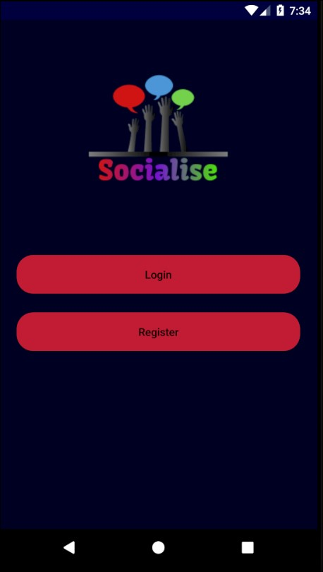
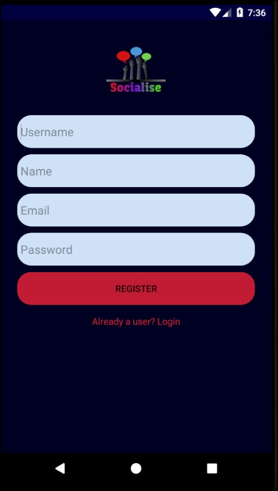
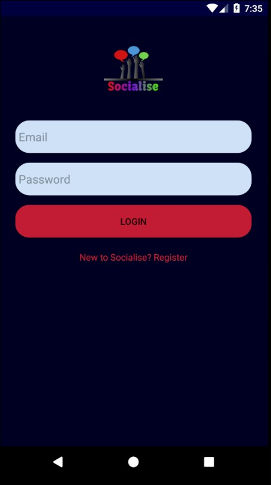
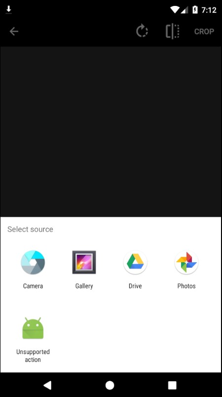
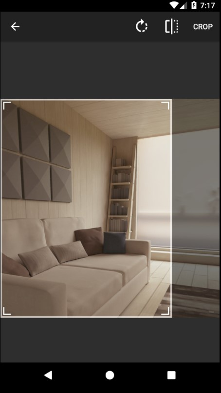
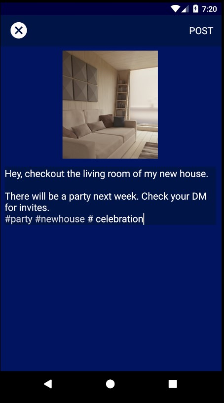

# Socialise

First project using Core Java, XML, and Firebase. 
I developed this application to learn Android Development. To provide additional features few open-source repositories have been used such as social view, android image cropper, etc. Images can be uploaded in real-time with content description either from apps like gallery or from the camera in this app and images can be cropped freely before posting. Firebase realtime database, storage, authentication etc are used on the back-end of this application.

Preview=> https://youtu.be/_k6Q8ORebTI

Icons by Google (Attribution): <a href="https://www.flaticon.com/authors/google" title="Google">Google</a> from <a href="https://www.flaticon.com/" title="Flaticon"> www.flaticon.com</a>

User Interface of post activity->	https://github.com/hendraanggrian/socialview 

Image Cropper->	https://github.com/ArthurHub/Android-Image-Cropper 
